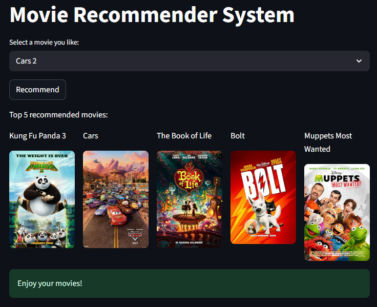

# 🎬 Movie Recommendation System

A **Content-Based Movie Recommendation System** built using **Python, Streamlit, Scikit-learn, and OMDb API**. This app recommends movies similar to the one you like and fetches their posters for a better experience.

---

## 📌 Objective

The main goal of this project is to recommend movies to users based on the **similarity of tags** (overview, genres, keywords, cast, and crew). The app uses **Natural Language Processing (NLP)** and **cosine similarity** to calculate closeness between movies and suggests the **Top 5 most similar movies** along with their posters.

---

## 🛠️ Tech Stack

* **Python 3.9+**
* **Libraries:**

  * `pandas` – Data preprocessing
  * `numpy` – Numerical computations
  * `scikit-learn` – TF-IDF/CountVectorizer + Cosine similarity
  * `nltk` – Porter stemming for text normalization
  * `pickle` – Model persistence (saving similarity matrix & movie dataframe)
  * `requests` – Fetching posters via OMDb API
  * `streamlit` – Frontend for interactive web app
* **Dataset:**

  * [TMDB 5000 Movies Dataset](https://www.kaggle.com/datasets/tmdb/tmdb-movie-metadata)
  
* **API:**

  * [OMDb API](http://www.omdbapi.com/) – To fetch movie posters dynamically 

---

## 📂 Project Structure

```
├── app.py                                     # Streamlit app
├── movie-recommender-system.ipynb             # Jupyter notebook with data preprocessing & similarity generation
├── movie_dict.pkl                             # Pickled dictionary of movie metadata
├── movies_df.pkl                              # Pickled dataframe (optional, backup)
├── similarity.pkl                             # Pickled cosine similarity matrix
├── requirements.txt                           # Project dependencies
├── README.md                                  # Project documentation
```

---

## ⚙️ Working of the Project

1. **Data Preprocessing**

   * Merge `movies` and `credits` datasets.
   * Extract `genres`, `keywords`, `cast` (top 3 actors), and `crew` (director).
   * Clean & transform into lists of keywords.
   * Combine everything into a new feature called **tags**.

2. **Text Processing**

   * Convert tags into lowercase.
   * Apply stemming to reduce words to their root forms (e.g., *“acting” → “act”*).

3. **Vectorization**

   * Use `CountVectorizer` to convert tags into feature vectors.
   * Generate a **Cosine Similarity Matrix** between all movies.

4. **Recommendation Logic**

   * Find the index of the selected movie.
   * Sort other movies by similarity score.
   * Return the **Top 5 movies**.

5. **Poster Fetching**

   * Use the **OMDb API** with the movie title (`t=movie_title`).
   * Extract poster URL and display it in Streamlit.

6. **Frontend (Streamlit)**

   * Select a movie from dropdown.
   * Click on **Recommend** button.
   * Display top 5 recommended movies with posters in columns.
   * Add animations (`balloons`, `snow`, `success message`) for fun UX.

---

## 💻 How to Run

### 1️⃣ Clone Repository

```bash
git clone https://github.com/Vandana029/movie-recommender-system.git
```

### 2️⃣ Install Dependencies

```bash
pip install -r requirements.txt
```

### 3️⃣ Run Streamlit App

```bash
streamlit run app.py
```

---

## 🎯 Input / Output Example



### Input:

User selects **“Car 2”** from the dropdown.

### Output:

Top 5 similar movies are displayed with posters:

1. Kung Fu Panda 3
2. Cars
3. The Book of Life
4. Bolt
5. Muppets Most Wanted

👉 Each recommendation is shown with its **poster image** fetched via OMDb API.

---

## 🚀 Future Enhancements

* Add **hybrid recommendation** (content + collaborative filtering).
* Use **Word2Vec / BERT embeddings** for better similarity.
* Implement **user login** & personalized recommendation.
* Deploy on **Streamlit Cloud / Heroku / AWS**.

---

## 🙌 Acknowledgements

* Dataset: [TMDB 5000 Movie Dataset](https://www.kaggle.com/datasets/tmdb/tmdb-movie-metadata)
* Posters & Metadata: [OMDb API](http://www.omdbapi.com/)

---

✨ **Enjoy your personalized movie night!** 🍿🎥
